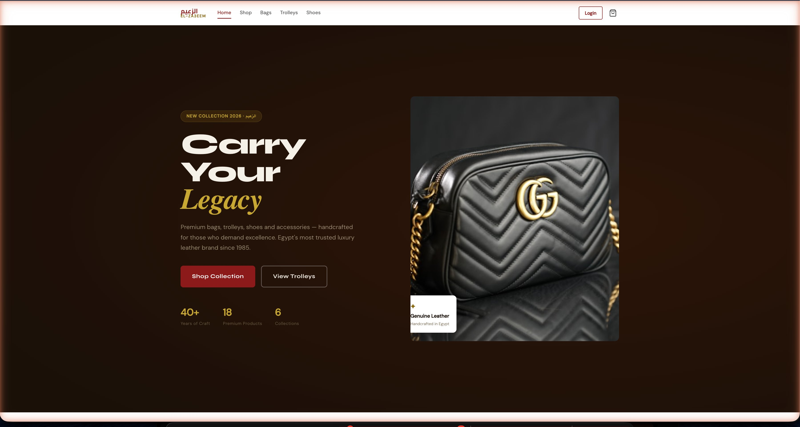
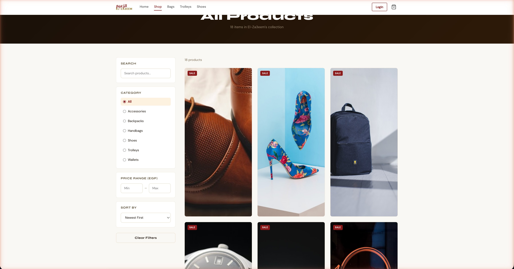
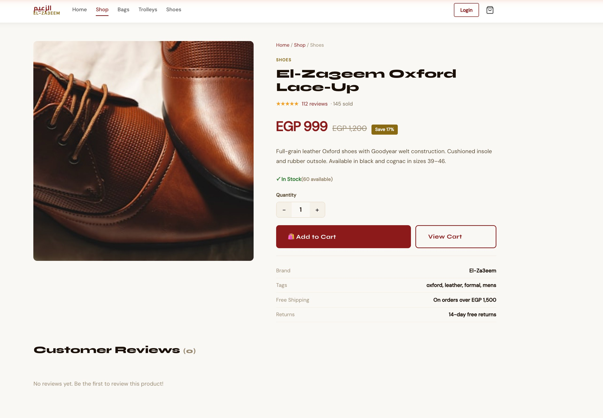
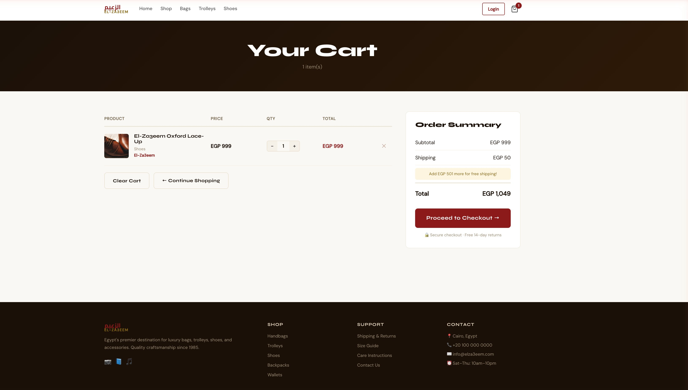
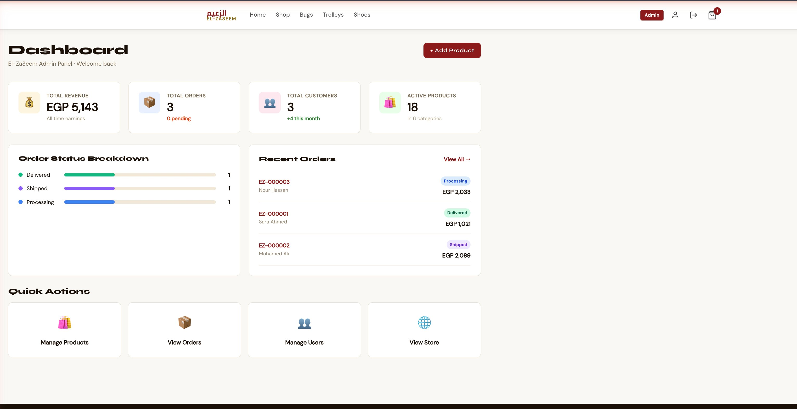
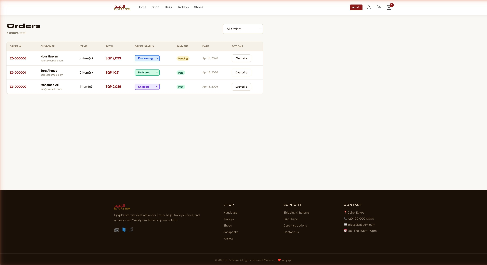
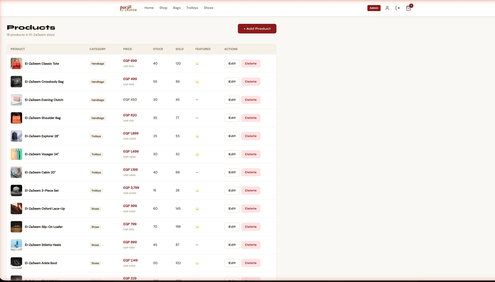
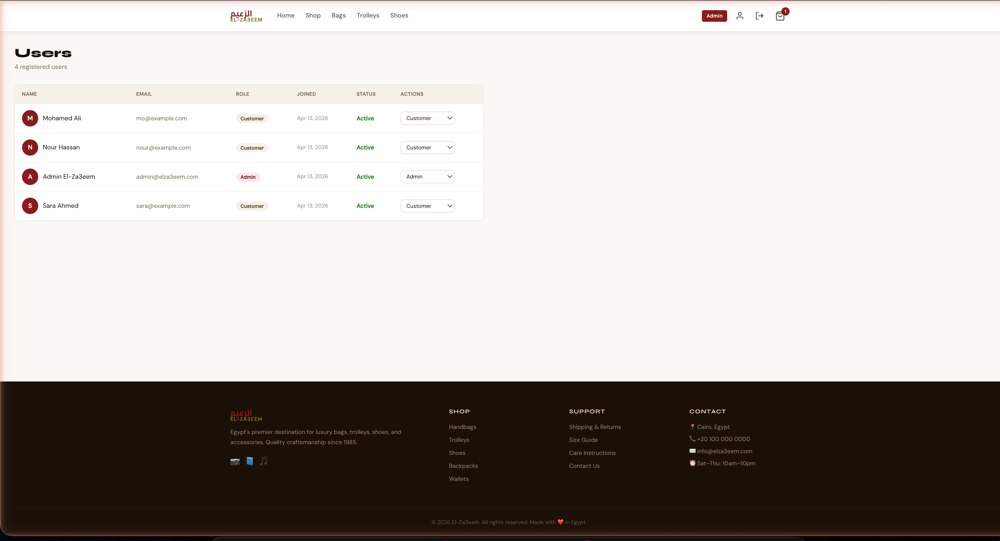
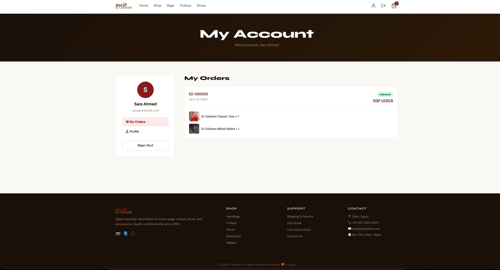

<div align="center">

<h1>الزعيم · El-Za3eem</h1>

**Egypt's Premier Luxury E-Commerce Platform**

A full-stack MEAN e-commerce application for premium bags, trolleys, shoes, and accessories — built with Angular 17, Node.js, Express, and MongoDB.

[](https://angular.io)
[](https://nodejs.org)
[](https://mongodb.com)
[](https://jwt.io)
[](https://typescriptlang.org)
[](LICENSE)

[Live Demo](#) · [Backend API Docs](#api-endpoints) · [GitHub](https://github.com/Ahito498/elza3eem-ecommerce)

</div>

---

## Screenshots

### 🏠 Home — Hero Section
Egypt's most trusted luxury leather brand since 1985. Dark editorial hero with product showcase and live stats.



---

### 🛍 Shop — Product Listing
Full product catalogue with sidebar filters: category, price range, sort. 18 products across 6 collections. SALE badges, stock indicators, and add-to-cart on every card.



---

### 👟 Product Detail Page
Rich product detail with image gallery, rating, stock count, quantity selector, add-to-cart, and customer reviews section.



---

### 🛒 Shopping Cart
Full cart with quantity controls, order summary, free shipping threshold tracker, and secure checkout button. Footer with full site map.



---

### 📊 Admin Dashboard
Real-time stats: total revenue (EGP 5,143), total orders, total customers, active products. Order status breakdown chart (Delivered / Shipped / Processing) and recent orders table.



---

### 📦 Admin — Orders Management
Full order table with inline status dropdowns (Processing → Shipped → Delivered → Cancelled), payment status badges, customer info, and order detail modal.



---

### 🏷 Admin — Products Management
Complete product CRUD table: 18 products across Handbags, Trolleys, Shoes, Wallets, Backpacks, Accessories. Discounted prices, stock, sold count, featured flag, Edit and Delete actions.



---

### 👥 Admin — Users Management
All registered users with avatar initials, email, role badge (Admin / Customer), join date, active status, and role update dropdown.



---

### 👤 My Account — Customer Dashboard
Customer account page with sidebar profile, order history showing order number, date, status badge (Delivered), total, and itemized order contents with product images.



---

## Features

### Customer-Facing
- **Home page** — Hero section, categories grid, featured products, brand story, why El-Za3eem
- **Product catalogue** — Search, filter by category/price, sort (newest, price, rating, best-selling), pagination
- **Product detail** — Image gallery, rating, stock status, quantity selector, add to cart, customer reviews
- **Shopping cart** — Quantity controls, free shipping threshold (EGP 1,500), real-time totals
- **Checkout** — Shipping form, payment method (Cash on Delivery / Credit Card), order placement
- **My Account** — Order history with status tracking, profile management

### Admin Panel
- **Dashboard** — Revenue, orders, customers, products stats + order status breakdown + recent orders
- **Products** — Full CRUD with image preview, category assignment, discount pricing, featured toggle
- **Orders** — Inline status updates, order detail modal, filter by status
- **Users** — Role management (Customer ↔ Admin), active status

### Technical
- **JWT Authentication** — Register, login, protected routes, role-based guards
- **REST API** — Full CRUD on Products, Categories, Orders, Users
- **Cart** — Signal-based Angular cart with localStorage persistence
- **Role-based routing** — Angular guards for customer and admin routes
- **Lazy loading** — All feature modules loaded on demand

---

## Tech Stack

| Layer | Technology |
|-------|-----------|
| **Frontend** | Angular 17 (Standalone Components, Signals) |
| **Language** | TypeScript 5.4 |
| **Backend** | Node.js + Express.js |
| **Database** | MongoDB + Mongoose |
| **Auth** | JWT (JSON Web Tokens) + bcryptjs |
| **Styling** | Custom CSS + Google Fonts (Syne, DM Sans, Cairo) |
| **State** | Angular Signals + localStorage |
| **HTTP** | Angular HttpClient + Interceptors |

---

## Project Structure

```
elza3eem-ecommerce/
├── backend/
│   ├── src/
│   │   ├── middleware/
│   │   │   └── auth.middleware.js      # JWT protect + authorize(roles)
│   │   ├── models/
│   │   │   ├── user.model.js           # User + bcrypt + comparePassword
│   │   │   ├── product.model.js        # Product + reviews sub-schema
│   │   │   ├── category.model.js       # Category + auto-slug
│   │   │   └── order.model.js          # Order + auto order number (EZ-000001)
│   │   ├── routes/
│   │   │   ├── auth.routes.js          # register, login, /me, change-password
│   │   │   ├── product.routes.js       # CRUD + search/filter/paginate + reviews
│   │   │   ├── category.routes.js      # CRUD + products by category
│   │   │   ├── order.routes.js         # place, my orders, all orders, stats
│   │   │   ├── user.routes.js          # admin user management + platform stats
│   │   │   └── cart.routes.js          # server-side cart validation
│   │   └── server.js                   # Express app entry point
│   ├── seed.js                         # Database seeder (18 products, 4 users, 3 orders)
│   ├── package.json
│   └── .env.example
│
└── frontend/
    └── src/
        ├── app/
        │   ├── app.component.ts        # Root shell — navbar + footer
        │   ├── app.routes.ts           # Lazy-loaded routes
        │   ├── core/
        │   │   ├── guards/             # authGuard + adminGuard
        │   │   ├── interceptors/       # JWT Bearer token attachment
        │   │   └── services/
        │   │       ├── auth.service.ts     # Signals-based auth
        │   │       ├── product.service.ts  # Product API calls
        │   │       ├── cart.service.ts     # Signals-based cart
        │   │       └── data.services.ts    # Category, Order, User services
        │   └── features/
        │       ├── home/               # Hero, categories, featured products
        │       ├── products/           # Product list + product detail
        │       ├── cart/               # Cart page
        │       ├── checkout/           # Checkout form + order placement
        │       ├── auth/               # Login + Register
        │       ├── account/            # My orders + profile
        │       └── admin/
        │           ├── dashboard/      # Stats + charts + recent orders
        │           ├── products/       # Product CRUD table
        │           ├── orders/         # Orders table + status updates
        │           └── users/          # Users table + role management
        ├── environments/
        │   └── environment.ts
        ├── main.ts
        └── styles.css                  # Global styles + utility classes
```

---

## API Endpoints

### Auth
| Method | Endpoint | Access | Description |
|--------|----------|--------|-------------|
| POST | `/api/auth/register` | Public | Register new user |
| POST | `/api/auth/login` | Public | Login + get JWT |
| GET | `/api/auth/me` | Protected | Current user profile |
| PUT | `/api/auth/me` | Protected | Update profile |
| PUT | `/api/auth/change-password` | Protected | Change password |

### Products
| Method | Endpoint | Access | Description |
|--------|----------|--------|-------------|
| GET | `/api/products` | Public | List with search/filter/paginate |
| GET | `/api/products/featured` | Public | Featured products |
| GET | `/api/products/:id` | Public | Product detail |
| POST | `/api/products` | Admin | Create product |
| PUT | `/api/products/:id` | Admin | Update product |
| DELETE | `/api/products/:id` | Admin | Soft delete |
| POST | `/api/products/:id/reviews` | Customer | Add review |

### Orders
| Method | Endpoint | Access | Description |
|--------|----------|--------|-------------|
| POST | `/api/orders` | Customer | Place order |
| GET | `/api/orders/my` | Customer | My orders |
| GET | `/api/orders` | Admin | All orders |
| PUT | `/api/orders/:id/status` | Admin | Update order status |
| GET | `/api/orders/admin/stats` | Admin | Dashboard stats |

---

## Getting Started

### Prerequisites
- Node.js 18+
- MongoDB (local or Atlas)
- Angular CLI 17

### Backend Setup

```bash
cd backend
npm install
cp .env.example .env
# Fill in MONGODB_URI and JWT_SECRET
node seed.js        # Seed database with El-Za3eem products
npm run dev         # Start on port 5000
```

### Frontend Setup

```bash
cd frontend
npm install
ng serve            # Start on port 4200
```

Open `http://localhost:4200`

### Demo Credentials

| Role | Email | Password |
|------|-------|----------|
| **Admin** | admin@elza3eem.com | admin123 |
| **Customer** | sara@example.com | customer123 |

---

## Seeded Data

- **6 Categories** — Handbags, Trolleys, Shoes, Wallets, Backpacks, Accessories
- **18 Products** — With real EGP prices, Unsplash images, descriptions, stock levels
- **4 Users** — 1 admin + 3 customers
- **3 Sample Orders** — EZ-000001 (Delivered), EZ-000002 (Shipped), EZ-000003 (Processing)

---

## Author

**Hassan Ahmed Rashwan**
4th-year Communication & Information Engineering · Zewail City of Science and Technology

[](https://github.com/Ahito498)
[](https://hrashwan-portfolio.netlify.app)
[](https://linkedin.com/in/hassan-rashwan-798484256)

---

## License

MIT License — free to use, fork, and build on.
